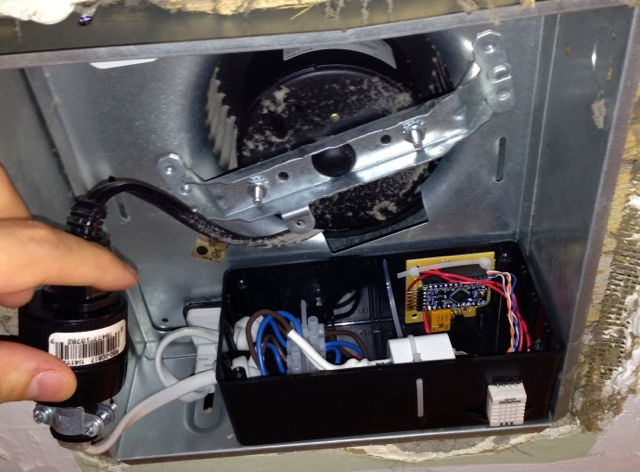

# Bathroom Fan Controller

Using an Arduino and RHT03 Humidity Sensor, turn on a bathroom fan when necessary.

Requires DHT22 library by Ben Adams: https://github.com/jasonluther/Arduino-DHT22

Parts:

* RHT03 temperature & humidity sensor - <https://www.sparkfun.com/products/10167>
* Arduino Pro Mini 328 5V/16MHz - <https://www.sparkfun.com/products/11113> and headers
* 5v relay
* 1N4148 signal diode for the relay
* Resistors
* Terminal block for 120VAC wiring
* Plug and socket for 120VAC
* iPhone charger for 5V power supply, with scrap USB connector
* Radio Shack perfboard and enclosure

## Usage

Main voltage (120VAC or 220VAC) can kill you and/or start a fire. Please be careful. 

THE SOFTWARE IS PROVIDED "AS IS", WITHOUT WARRANTY OF ANY KIND,
EXPRESS OR IMPLIED, INCLUDING BUT NOT LIMITED TO THE WARRANTIES OF
MERCHANTABILITY, FITNESS FOR A PARTICULAR PURPOSE AND NONINFRINGEMENT.
IN NO EVENT SHALL THE AUTHORS BE LIABLE FOR ANY CLAIM, DAMAGES OR
OTHER LIABILITY, WHETHER IN AN ACTION OF CONTRACT, TORT OR OTHERWISE,
ARISING FROM, OUT OF OR IN CONNECTION WITH THE SOFTWARE OR THE USE OR
OTHER DEALINGS IN THE SOFTWARE.

This work is placed into the public domain. 
